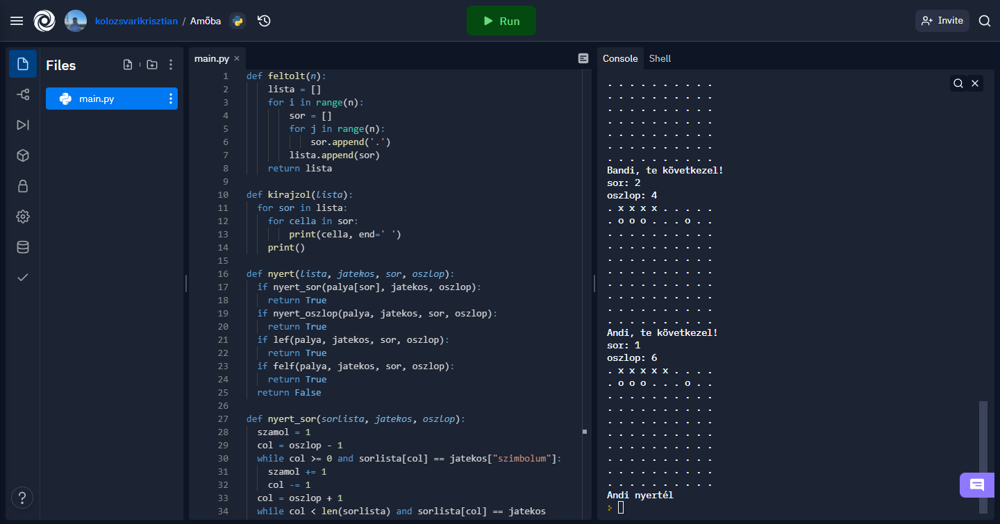

# Amőba program Python-ban
## 3 x 3 - as méretben
Ez egy próbaverzió

## 10 x 10 - es méretben
### Az amőba játék leírása

Az amőba kétszemélyes absztrakt stratégiai táblás játék, a gomoku változata. A győzelemhez (legalább) öt bábunkat kell egy vonalba lerakni. A standard gomokutól eltérően (amelyben az 5-nél hosszabb sor nem nyer) az amőbában különleges virtusnak számít a hosszabb (legalább 6 bábut tartalmazó) győztes sor kirakása.

Az amőba elméletileg a táblás játékok közé tartozik, de a valóságban jellemzően egy füzet kockás papírján, ceruzával, tollal, gyerekek szokták játszani. A tábla mérete nem kötött, a játék a füzetlap széléig, a még szabad területen folyik.

 játék a nevét onnan kapta, hogy a győztesé az a „megtiszteltetés”, hogy a végül létrejött alakzatot (szögletes vagy görbe vonallal) szorosan körberajzolja. Az így létrejött vonal egy állábakat növesztett amőbára hasonlít.
 
 ### Játékmenet
 
 A játék nem sokban különbözik a gomokutól, csak nincs rögzítve a tábla mérete, és így nem is kerülhet sorra a bábuk tologatásával játszott második játékszakasz.

A két játékos felváltva tesz egy-egy bábut a táblára. A játék célja, hogy vízszintes, függőleges vagy átlós irányban megszakítás nélkül öt saját bábut sikerüljön letenni. Az ellenfél ezt a kialakulni látszó vonal végére tett bábukkal próbálja megakadályozni.

A papíron játszott, legjellemzőbb változatban az egyik játékos X, a másik O jelekkel helyettesíti a bábukat, a játék Ox elnevezése innen ered, bár azt a Tic-tac-toe-ra is használják. A kétféle jelet szokták kétféle színnel is jelölni, ahogy az a fényképen is látható.

[A program megtekintése a replit.com oldalon](https://replit.com/@kolozsvarikrisztian/Amoba#main.py)

### Pillanatkép egy játékmenet közben:

